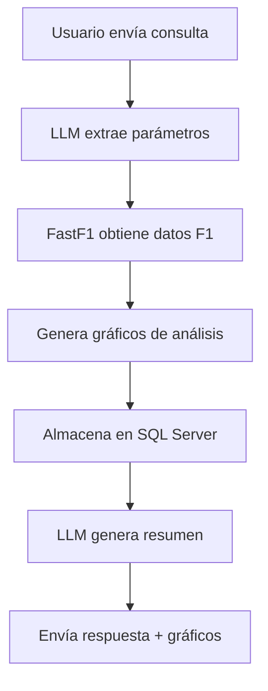

# F1Bot - Bot de Análisis de Franco Colapinto 🏎️

Un bot de Telegram inteligente que analiza el rendimiento de Franco Colapinto en Fórmula 1 utilizando datos oficiales de FastF1, LLM local y visualizaciones avanzadas.

## 📋 Características

- **Análisis en tiempo real**: Obtiene datos oficiales de Fórmula 1 usando FastF1
- **Visualizaciones interactivas**: Genera gráficos de rendimiento, tiempos por vuelta, posiciones de carrera y distribución de laptimes
- **IA integrada**: Utiliza Ollama (LLM local) para generar análisis detallados en español
- **Base de datos**: Almacena análisis históricos en SQL Server
- **Interface de Telegram**: Interacción natural a través de mensajes

## 🛠️ Tecnologías Utilizadas

- **Python 3.8+** - Lenguaje principal
- **FastF1** - API oficial de datos de Fórmula 1
- **Telegram Bot API** - Interface de usuario
- **Ollama** - Modelo de lenguaje local (Mistral)
- **SQL Server** - Base de datos
- **Docker & Docker Compose** - Containerización
- **Matplotlib & Seaborn** - Visualización de datos
- **Pandas & NumPy** - Procesamiento de datos

## 🏁 ¿Cómo Funciona?

1. **Recibe consulta**: El usuario envía una pregunta sobre Franco Colapinto
2. **Extrae parámetros**: La IA identifica piloto, año y circuito de la consulta
3. **Obtiene datos**: Descarga datos oficiales de F1 usando FastF1
4. **Genera análisis**: Crea múltiples gráficos de rendimiento
5. **Almacena resultados**: Guarda en base de datos para consultas futuras
6. **Envía respuesta**: Genera resumen con IA y envía gráficos al usuario



## 📦 Instalación

### Opción 1: Docker (Recomendado)

1. **Clona el repositorio**
```bash
git clone <url-del-repositorio>
cd f1Bot
```

2. **Configura variables de entorno**
```bash
# Crea un archivo .env con tu token de Telegram
echo "TELEGRAM_BOT_TOKEN=tu_token_aqui" > .env
```

3. **Ejecuta con Docker Compose**
```bash
docker-compose up -d
```

### Opción 2: Instalación Local

1. **Instala dependencias del sistema**
```bash
# Instala Ollama
curl -fsSL https://ollama.com/install.sh | sh
ollama pull mistral

# Instala SQL Server (o usa Docker)
```

2. **Configura Python**
```bash
python -m venv venv
source venv/bin/activate
pip install -r requirements.txt
```

3. **Configura base de datos**
```bash
# Configura conexión a SQL Server en las variables de entorno
export DB_SERVER=localhost
export DB_NAME=f1Info
export DB_USER=sa
export DB_PASSWORD=tu_password
```

4. **Ejecuta el bot**
```bash
python bot/botHandler.py
```

## 🚀 Uso del Bot

### Comandos Disponibles

- `/start` - Inicia el bot y muestra ejemplos de uso

### Ejemplos de Consultas

```
"¿Cómo le fue a Colapinto en Monza 2024?"
"Analiza el rendimiento de Franco en Las Vegas 2024"
"Colapinto Monaco 2024"
"Franco Qatar 2024 análisis"
```

### Tipos de Análisis Generados

1. **Cambios de Posición en Carrera**
   - Gráfico que muestra la evolución de posiciones vuelta a vuelta
   - Comparación con otros pilotos del grid

2. **Tiempos por Vuelta**
   - Análisis de consistencia y ritmo de carrera
   - Identificación de compound de neumáticos usado
   - Línea de tendencia del rendimiento

3. **Distribución de Laptimes**
   - Histograma de tiempos por vuelta
   - Análisis estadístico del rendimiento

4. **Resultados de Clasificación**
   - Comparación de tiempos en Q1, Q2, Q3
   - Posición final obtenida

## 📊 Ejemplos de Salida
### Ejemplos de Gráfico Generado


*Gráfico que muestra la evolución de posiciones durante la carrera*


*Análisis de tiempos por vuelta con identificación de compounds*

## 📄 Licencia

Este proyecto está bajo la Licencia MIT. Ver el archivo [LICENSE](LICENSE) para más detalles.

## 🏎️ Sobre Franco Colapinto

Franco Colapinto es un piloto de automovilismo argentino que compite en la Fórmula 1. Este bot está dedicado a analizar su rendimiento y proporcionar insights detallados sobre su progreso en la máxima categoría del automovilismo.

---